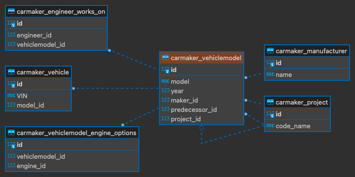

# Handling model relations with Django REST Framework ModelSerializer

---
_Deep dive on using Django REST Framework ModelSerializer to read, create and update model relations_

[Postman](https://www.postman.com/quackyduck/workspace/deep-dive-drf-modelserializer-relations/collection/25111927-777d6f3f-08ab-4cdd-b4ba-abf5c50648fe?ctx=documentation)
is used for developing the APIs.

# Part I: The basics

In Part I, we are going to set up a few Django models for us to play with, and then set up a couple of REST APIs using
ModelSerializers; nothing special going on here if you are already familiar with how to use DRF generic views.


In the center of our ERD, the `VehicleModel` model has the following relations:

- One-to-one relation with `Project`
- Many-to-one (foreign key) relation with `Manufacturer`
- Many-to-one (foreign key) relation with `VehicleModel` (itself)
- Many-to-many relation with `Engine`

As well as the following Django reverse relations:

- Many-to-one (foreign key) relation from `Vehicle`
- Many-to-many relation from `Engineer`

See [carmaker.models](carmaker/models.py) for details on the model set up.

For this part, I've also set up a couple of views using Django REST Framework generic views with ModelSerializers.
Because I want to expand on the APIs later, I'm putting the APIs in Part I in their own module called [api_1](api_1).

With a standard `ModelSerializer` for `VehicleModel` such as:

```python
class VehicleModelSerializer(ModelSerializer):
    class Meta:
        model = VehicleModel
        fields = "__all__"
```

and a standard `ListCreateAPIView`:

```python
class VehicleModelListCreateView(ListCreateAPIView):
    permission_classes = [AllowAny]
    queryset = VehicleModel.objects.all()
    serializer_class = VehicleModelSerializer
```

We can start testing these APIs.

## Basic read behavior

We can now call the listing endpoint using:

```commandline
curl --location --request GET 'http://localhost:8000/api_1/'
```

_you can also use
this [Postman example](https://www.postman.com/quackyduck/workspace/deep-dive-drf-modelserializer-relations/request/25111927-987f0fef-d4df-4ffe-85a6-8f51fad1b421)
._

and get the following response:

```json
[
  {
    "id": 1,
    "model": "Buick D-35 Roadster",
    "year": 1917,
    "project": 1,
    "maker": 1,
    "predecessor": null,
    "engine_options": [
      1,
      2
    ]
  }
]
```

We can make the following observations:
> **TLDR** DRF `ModelSerializer`'s basic **read** behavior:
> - Returns Django model attributes as they are defined on ORM model, including auto fields
> - Returns value of appropriate type as defined by the ORM model field
> - Includes all relations declared on the ORM model
> - The related instances are returned as their primary keys
> - Does not include any Django reverse relations

## Basic write behavior

Similarly, we can call the same endpoint to create a new instance:

```commandline
curl --location --request POST 'http://localhost:8000/api_1/' \
--header 'Content-Type: application/json' \
--data-raw '{
        "model": "Buick D-35 Roadster 2",
        "year": 1919,
        "project": null,
        "maker": 1,
        "predecessor": 1,
        "engine_options": [
            1,
            2
        ]
    }'
```

you can also use
this [Postman example](https://www.postman.com/quackyduck/workspace/deep-dive-drf-modelserializer-relations/request/25111927-889545d1-03d0-47cd-965e-7bf49c832f26)
.

You can play around with this request data, and try to include some additional related fields, and make the following
observations:

> **TLDR** DRF `ModelSerializer`'s basic **write** behavior:
> - Relations can be made using existing related instance primary key
> - Django reverse relations are ignored
> - Unrecognized and read-only attributes are ignored

---

# Part II: Include related instance data

Part II example code can be found in module [api_2](api_2).

A common way of including related instance data is through nesting of the serializers:

```python
class VehicleModelSerializer(ModelSerializer):
    project = ProjectSerializer()
    maker = ManufacturerSerializer()
    engine_options = EngineSerializer(many=True)
    vehicle_set = VehicleSerializer(many=True)  # reverse relation 'vehicle_set'
    engineers_responsible = EngineerSerializer(many=True, source="engineer_set")  # reverse relation 'engineer_set'

    class Meta:
        model = VehicleModel
        fields = "__all__"
```

## Reading related model data using nested serializer

With this serializer, we can hit
the [listing endpoint](https://www.postman.com/quackyduck/workspace/deep-dive-drf-modelserializer-relations/request/25111927-6f367f5f-8209-4386-ad77-8ac08c8bed01)
again. Note that the reverse relations will even work as
long as the reverse attribute name declared on the serializer matches what is on the ORM model, or
initialized with the `source` argument pointing to a matching ORM model attribute.
You should see the response data containing a list of objects like the following:

```json
{
  "id": 1,
  "project": {
    "id": 1,
    "code_name": "project-d-35-roadster"
  },
  "maker": {
    "id": 1,
    "name": "Buick"
  },
  "engine_options": [
    {
      "id": 1,
      "name": "Model D Inline-4",
      "displacement": 2.7
    },
    {
      "id": 2,
      "name": "Chevrolet Inline-4",
      "displacement": 2.8
    }
  ],
  "vehicle_set": [
    {
      "id": 1,
      "VIN": "A123456789",
      "model": 1
    }
  ],
  "engineers_responsible": [
    {
      "id": 1,
      "name": "Yoshida",
      "works_on": [
        1
      ]
    }
  ],
  "model": "Buick D-35 Roadster",
  "year": 1917,
  "predecessor": null
}
```

> **TLDR** DRF nested serializer **read** behavior:
> - Related instance nested serializer must be initialized with `many=True` if there are more than one instance expected
> - Django ORM reverse relations also work if matching model attribute name or specified by `source` argument

## Writing related model data using nested serialier

I think creating and updating related instance is probably not good RESTful design, but sometimes we may be asked to do
so because the related model may be very small.

Interestingly, if we try to call the creation endpoint, DRF will complain about not sure what to do with the related
model data.

To allow writing to related models, we will need to overwrite the `VehicleModelSerializer.to_internal_value()` method
so that the related fields provided by the client is mapped back to related model instances:

```python
class VehicleModelSerializer(ModelSerializer):
    project = ProjectSerializer()
    maker = ManufacturerSerializer()
    engine_options = EngineSerializer(many=True)
    vehicle_set = VehicleSerializer(many=True, read_only=True)
    engineers_responsible = EngineerSerializer(many=True, source="engineer_set")

    def to_internal_value(self, data):
        new_data = super().to_internal_value(data)

        new_data["maker"] = Manufacturer.objects.get(**new_data["maker"])

        engine_options_q = Q()
        for engine in new_data["engine_options"]:
            engine_options_q |= Q(**engine)
        new_data["engine_options"] = Engine.objects.filter(engine_options_q)

        engineer_set_q = Q()
        for engineer in new_data["engineer_set"]:
            engineer_set_q |= Q(**engineer)
        new_data["engineer_set"] = Engineer.objects.filter(engineer_set_q)

        return new_data
```

and with this, we can call
the [creation API](https://www.postman.com/quackyduck/workspace/deep-dive-drf-modelserializer-relations/request/25111927-1e60feff-c5ea-4732-86df-049c74a99586)
with the following data to create a new instance of `VehicleModel` as
well
as the associated `Project` instance, relations to existing `Manufacturer`, `Engine` and `Engineer` instances will be
made:

```json
{
  "project": {
    "code_name": "project-d-35-roadster-3"
  },
  "maker": {
    "name": "Buick"
  },
  "engine_options": [
    {
      "name": "Model D Inline-4",
      "displacement": 2.7
    },
    {
      "name": "Chevrolet Inline-4",
      "displacement": 2.8
    }
  ],
  "vehicle_set": [
    {
      "VIN": "A123456789",
      "model": 1
    }
  ],
  "engineers_responsible": [
    {
      "name": "Yoshida"
    }
  ],
  "model": "Buick D-35 Roadster",
  "year": 1917,
  "predecessor": null
}
```

Note that in this example, we are only handling the fields where we want the API to retrieve existing related instances,
which are 'maker', 'engine_options', and 'engineers_responsible'. We did not handle any fields where the API may be
required to create new instances of related model such as 'project'. (`Project` and `VehicleModel` have one-to-one
relation, so we are pretending that one of the API requirements is that when creating a new `VehicleModel`, also
create a `Project` at the same time).

We could have created a new instance of `Project` in `.to_internal_value` method, but we elect not to do it here in case
there is validation issue with the data from client later on, and we wouldn't want a `Project` instance to be created
before data validation completes. Instead, we will handle related object creation by overwriting the `.create()`
method:

```python
class VehicleModelSerializer(ModelSerializer):
    ...  # omitted, see above

    def create(self, validated_data):
        validated_data["project"] = Project.objects.create(**validated_data.pop("project"))
        instance = super().create(validated_data)
        return instance
```

Now, you may have noticed that the 'vehicle_set' attribute from the serializer is not being handled, because we have
initialized this field as a read-only field, therefore the data is stripped by the `ModelSerializer.to_internal_value()`
method. This would be based on the specific API design requirements.

Similar to the handling of creation, we may be asked to handle updating of the related model as well, it can be done in
very similar fashion by overwriting the `.update()` method:

```python
class VehicleModelSerializer(ModelSerializer):
    ...  # omitted, see above

    def update(self, instance, validated_data):
        project_data = validated_data.pop("project", None)
        if project_data is not None and instance.project.code_name != project_data["code_name"]:
            instance.project.delete()
            validated_data["project"] = Project.objects.create(**project_data)
        return super().update(instance, validated_data)

```

Note that we are checking `project_data is not None`, this may or may not be the desired behavior based on API design
requirement. You may be asked to delete the related `Project` if the client passes `null` value or empty string, or not
do anything with it, etc. Some requirements may not be good RESTful API design, but it can happen.

By now you might have noticed that you cannot update a `VehicleModel` instance with the same `Project`, but you can
update it to new `Project` with different 'code name'. This is because `Project` model's 'code name' field has unique
constraint, and `.to_internal_value()` will validate client data against field level validation which includes ORM
model field arguments.

If for some reason you need to allow client to specify the `Project`'s 'code name' again in
the body (such as in the case of a 'PUT' request where you are essentially replacing the current instance), you may
consider bypassing some of the data from `super().to_internal_value()`:

```python
class VehicleModelSerializer(ModelSerializer):
    ...

    def to_internal_value(self, data):
        project_data = data.pop("project", None)
        new_data = super().to_internal_value(data)
        if project_data:
            new_data["project"] = project_data
        ...
        return new_data
```

Note the project data is popped from `data` to circumvent being pushed into `super().to_internal_value()`, and then
added back to the `new_data` before return.

Another key thing to note is that if you put a debug breakpoint inside of the `.to_internal_value()` method, you would
see that the `data` passed in has been changed by `super().to_internal_value(data)` (aka `new_data` in our example).
While `data` has key 'engineers_responsible' which is how the client passes in, `new_data` change it to key
'engineer_set'. This is one of DRF `ModelSerializer.to_internal_value()` method's responsibility: to map raw data to
ORM field data.

Some takeaways:
> **TLDR** DRF nested serializer **write** behavior:
> - `.to_internal_value()` method is called before `.validate()`
> - `.to_internval_value()` method validates against field-level constraints set by ORM model fields
> - `.to_internal_value()` method maps raw client data to ORM field data, which may change data keys if a field's name
    is different from its `source`
> - when nesting a related model serializer as a serializer field, we need to take care of mapping them back to Django
    ORM model instances, it is a good idea to:
> > - Retrieve existing relations inside `.to_internal_value()`
> > - Create/update new related instances inside `.create()`/`.update()`

---

# Part III: Hoisting related model data

Part III example code can be found in module [api_3](api_3).

Often times we are asked to design an endpoint for a particular model that includes some attributes of a related model,
and in away that the related data appears to be attributes of this model as far as the client is concerned.
This can be implemented in a number of different ways with DRF, but I am only going to focus on achieving two-way data
binding - so it works consistently in both **read** and **write** operations using a single mechanism.

## Reading related model data directly

For this example, let's hoist the related `Project` instance's `code_name` attribute to our `VehicleModel` serializer
so that it would appears as an attribute of the `VehicleModel`. We are going to use a custom field:

```python
class ProjectCodeNameField(RelatedField):
    queryset = Project.objects.all()

    def to_internal_value(self, data):
        return data

    def to_representation(self, value):
        return getattr(value, "code_name")
```

and now we can use this field on our serializer for `VehicleModel`:

```python
class VehicleModelSerializer(ModelSerializer):
    project_code_name = ProjectCodeNameField(source="project")

    class Meta:
        model = VehicleModel
        fields = "__all__"
```

We can hit
the [listing endpoint](https://www.postman.com/quackyduck/workspace/deep-dive-drf-modelserializer-relations/request/25111927-b3a59e33-75c4-4b96-a85a-289f8a6b3d9e)
again, and you should see the response containing list of `VehicleModel` objects
such
as this:

```json
{
  "id": 1,
  "project_code_name": "project-d-35-roadster-x1",
  "model": "Buick D-35 Roadster2",
  "year": 1917,
  "project": 4,
  "maker": 1,
  "predecessor": null,
  "engine_options": [
    1,
    2
  ]
}
```

where the related `Project.code_name` has been made available as 'project_code_name'.

## Writing related model data directly

Similar to what we did in Part II, we need to handle related model instance creation by overwriting `.create()` method:

```python
class VehicleModelSerializer(ModelSerializer):
    maker = ManufacturerNameField()
    project_code_name = ProjectCodeNameField(source="project")

    def to_internal_value(self, data):
        new_data = super().to_internal_value(data)
        new_data["maker"] = Manufacturer.objects.get(name=new_data["maker"])
        return new_data

    def create(self, validated_data):
        if validated_data.get("project"):
            validated_data["project"] = Project.objects.create(code_name=validated_data["project"])
        return super().create(validated_data)

    class Meta:
        model = VehicleModel
        fields = "__all__"
```

I also intentionally added another field `maker` here to demonstrate how the it is handled a little bit
different from `project_code_name` field. The `maker` field is pointing to the related `Manufacturer` instance's 'name',
while the `project_code_name` is point to the related `Project` instance's 'code_name'. Just like what we did earlier in
Part II, we are assuming the API requirement dictates that it only needs to associate the `VehicleModel` instance
to be created with an **existing** `Manufacturer` instance, but associated with a **new** `Project` instance (because of
the one-to-one relationship).

For this reason, we are mapping the `maker` field to an existing `Manufacturer` instance inside `.to_internal_value()`,
while creating a new `Project` instance inside the `.create()`.

Some takeaways regarding accessing related model data directly:

> **TLDR** DRF serializer accessing related model data:
> - subclass `restframework.serializers.RelatedField` for accessing an attribute of a related model, this allows for
    reading and writing using the same mechanism
> - whenever writing to related model, we need to handle write behavior, it is a good idea to:
> > - Retrieve existing relations inside `.to_internal_value()`
> > - Create/update new related instances inside `.create()`/ `.update()`

